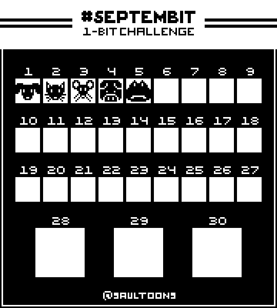

# SeptemBIT 2020 | "Creatures"

This year's challenge is to use only black and white to create these pixel projects.

## Color Pallet
- #000000 - Black
- #FFFFFF - White

## Size Requirements
- Days 1-27 - 16x16px
- Days 28-30 - 32x32px

## What is SeptemBIT?

SeptemBIT is a challenge created by Saultoons. Each year, he hosts a challenge where for every day for the month of September, you need to create a pixel art piece based on a theme. He will provide a prompt, color pallet, and any other constraints that may be applicable to the challenge.

You can find Saultoons at: 
- [YouTube](https://www.youtube.com/@saultoons)
- [X/Twitter](https://x.com/saultoons)
- [Instagram](https://www.instagram.com/saultoons)
- [Linktree](https://linktr.ee/saultoons)

# My Submission

     

